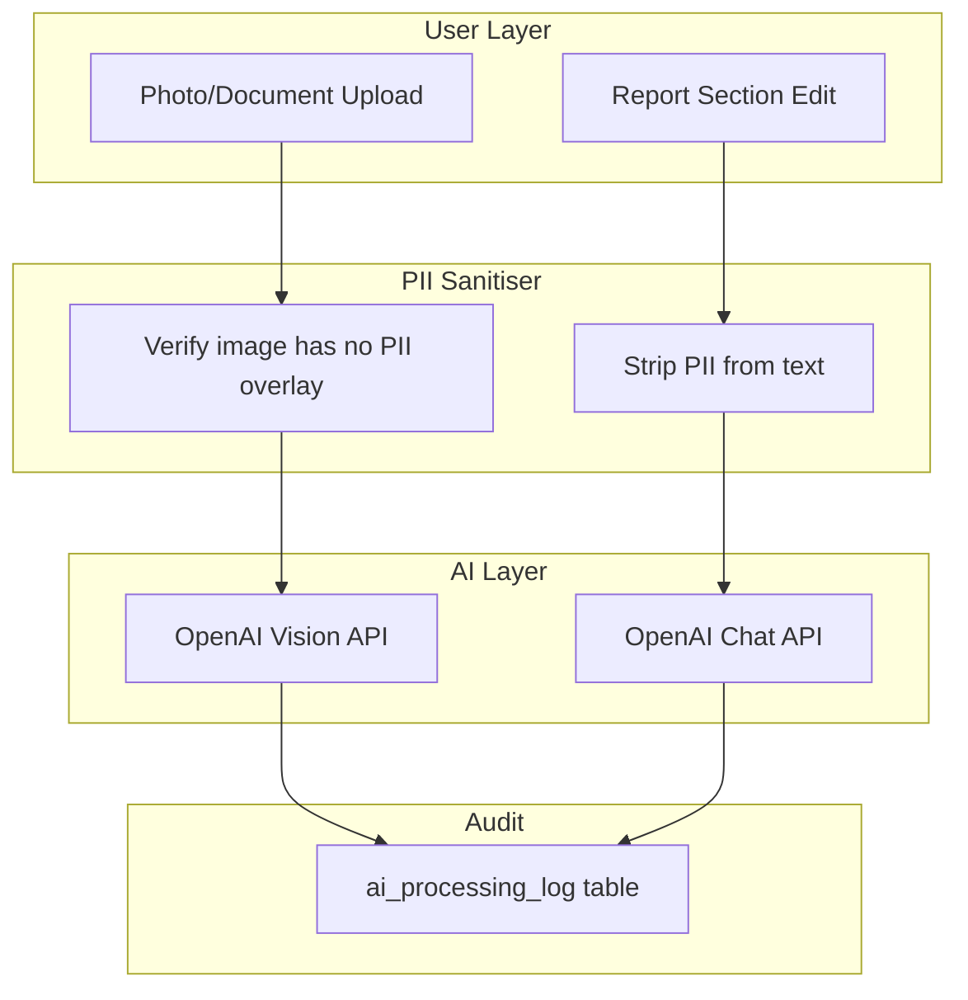
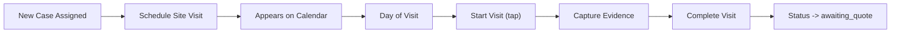
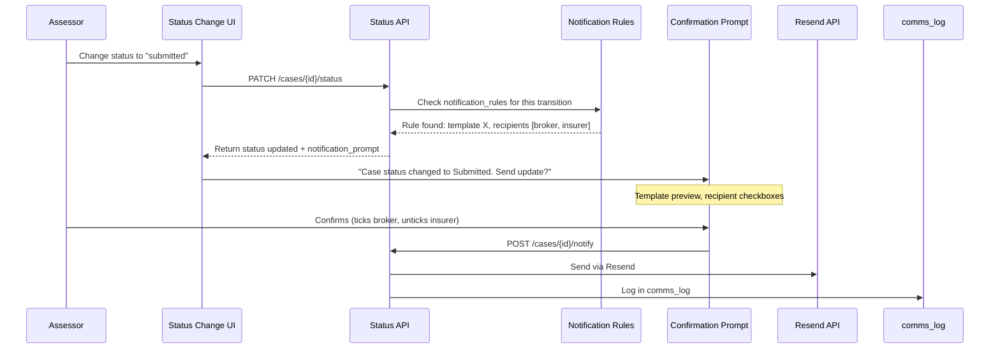

# Refrag Feature Specification: AI, Filing, Scheduling, Notifications

**Document Purpose:** Build guide for four interconnected pillars: AI-assisted workflows (with POPIA compliance), case filing and retrieval, scheduling/calendar, and automated status notifications.

**Document Date:** 2026-02-14  
**Related Docs:** [REFRAG_VISION_AND_TARGET_STATE.md](REFRAG_VISION_AND_TARGET_STATE.md), [REFRAG_IMPLEMENTATION_ROADMAP.md](REFRAG_IMPLEMENTATION_ROADMAP.md)

---

## Context: What Exists Today

| Area | Current State | Key Files |
|------|---------------|-----------|
| Evidence | Manual tagging (VIN, ODOMETER, FRONT, REAR, etc.) | `web-app/src/app/api/evidence/`, `evidence_tags` table |
| Reports | Sections + PDF export via pdfkit | `web-app/src/app/api/reports/`, `web-app/src/app/api/exports/` |
| Comms | `comms_log` table, template system with placeholders | `web-app/src/app/app/cases/[id]/comms/page.tsx`, `comms_templates` table |
| Appointments | CRUD API, simple list view | `web-app/src/app/app/appointments/page.tsx`, `appointments` table |
| Status workflow | 8 statuses, audit logging only | `web-app/src/app/api/cases/[id]/status/route.ts` |
| Cases list | Flat list, basic search | `web-app/src/app/app/cases/page.tsx` |

**Gaps:** No AI packages, no Resend, no calendar UI, no case filtering, no status-based notifications.

---

## 1. AI Integration (OpenAI) with POPIA Ring-Fencing

### 1.1 Where AI Adds Value (Assessor/Insurer Perspective)

#### Evidence Photo Intelligence (High value)

**Pain point:** Assessors upload dozens of photos per case. Manually tagging each as "VIN plate", "Front damage", "Odometer" is tedious. Case packs with generic filenames (IMG_4521.jpg) are unprofessional.

**Solution:**
- Auto-classify uploaded photos using OpenAI Vision API (`gpt-4o`)
- Return structured label + confidence (e.g. "VIN plate", 0.92)
- Auto-apply as `evidence_tags` — assessor confirms or overrides
- On case pack PDF export, AI-generated labels replace filenames (e.g. "IMG_4521.jpg" → "Front bumper damage - close up")

**POPIA:** Vehicle photos contain no PII. Registration plates could contain PII but are already captured as structured data. AI sees the photo only, not case metadata.

#### Report Completeness Check (High value)

**Pain point:** Reports submitted with missing sections or weak content lead to additional requests and rework.

**Solution:**
- After assessor finishes report sections, AI analyses structure for:
  - Missing standard sections (e.g. no "Recommendation")
  - Sections unusually short
  - Whether damage assessment references evidence photos
  - Whether repair estimate present when status is "reporting"
  - Whether write-off evaluation addressed when repair exceeds threshold
- "Check Report" button returns suggestions panel

**POPIA:** Send only section headings and word counts, or sanitised text with PII stripped. AI never sees raw PII.

#### OCR Extraction Fallback (Medium value)

**Pain point:** Rule-based extraction sometimes yields low confidence. Schema already has `extraction_method = 'ai_fallback'` in `extracted_fields`.

**Solution:**
- When rule-based extraction yields low confidence, send only the relevant text snippet to AI: "From this text, extract the VIN number if present"
- Strip names, policy numbers before sending

**POPIA:** Send only the specific text fragment needed, not the full document.

#### Evidence Damage Severity Estimation (Medium value)

**Pain point:** Insurers want early severity signals. Assessors need prioritisation help.

**Solution:**
- AI analyses damage photos and suggests: "Minor scratch", "Moderate dent", "Severe structural"

**POPIA:** Pure image analysis, no PII.

#### Smart Case Prompts (Rule-based, not AI)

**Pain point:** Assessors forget routine checks.

**Solution (deterministic logic):**
- "You have 3 photos but no VIN photo — consider adding one"
- "Loss date was 30+ days ago — check if storage charges apply"
- "Client rule: write-off threshold 70% — repair (R45,000) is 68% of retail (R66,000). Close to threshold."

**POPIA:** No AI, no PII concern.

#### Transcription Summary (Future)

**Pain point:** Long call recordings need quick summaries.

**Solution:** After OpenAI Speech-to-Text, AI summarises key points. Summary must strip PII. Store separately. Flag that PII was processed; consent must be recorded (`consent_recorded` on recordings).

---

### 1.2 POPIA Ring-Fencing Architecture



**Principles:**
- New DB table: `ai_processing_log` — tracks every AI call (input hash, output, case_id, user_id, timestamp)
- PII sanitiser: regex-based stripping of SA ID numbers, phone numbers, email addresses, policy numbers, names
- All AI calls server-side only — never client-side
- AI responses stored as suggestions; never auto-committed without human confirmation

**International alignment:** GDPR Article 22 (automated decision-making), Article 5 (data minimisation). POPIA Section 71 (automated processing). Same principles apply: minimise data, human-in-the-loop, audit trail.

---

### 1.3 Database Schema: AI

```sql
CREATE TABLE ai_processing_log (
  id UUID PRIMARY KEY DEFAULT gen_random_uuid(),
  org_id UUID NOT NULL REFERENCES organisations(id) ON DELETE CASCADE,
  case_id UUID REFERENCES cases(id) ON DELETE SET NULL,
  evidence_id UUID REFERENCES evidence(id) ON DELETE SET NULL,
  actor_user_id UUID NOT NULL REFERENCES auth.users(id),
  operation TEXT NOT NULL,  -- 'classify_evidence', 'check_report', 'extract_field'
  input_summary TEXT,       -- non-PII description of what was sent
  output_summary TEXT,      -- non-PII description of result
  tokens_used INTEGER,
  created_at TIMESTAMPTZ NOT NULL DEFAULT NOW()
);

CREATE INDEX idx_ai_processing_log_org ON ai_processing_log(org_id);
CREATE INDEX idx_ai_processing_log_case ON ai_processing_log(case_id);
CREATE INDEX idx_ai_processing_log_created ON ai_processing_log(created_at);
```

---

### 1.4 Implementation Approach

| Component | Path | Purpose |
|-----------|------|---------|
| Package | `openai` (npm) | OpenAI SDK |
| Client init | `web-app/src/lib/ai/openai.ts` | Server-side client |
| Sanitiser | `web-app/src/lib/ai/sanitiser.ts` | PII stripping |
| Prompts | `web-app/src/lib/ai/prompts.ts` | Prompt templates |
| API: classify | `web-app/src/app/api/ai/classify-evidence/route.ts` | Evidence photo analysis |
| API: check report | `web-app/src/app/api/ai/check-report/route.ts` | Report completeness |
| API: extract | `web-app/src/app/api/ai/extract-field/route.ts` | OCR fallback |

**UI:**
- Evidence upload: show "AI is analysing..." then suggested tag with confirm/reject
- Report page: "Check Report" button → suggestions panel

---

## 2. Filing System — Case Organisation and Retrieval

### 2.1 Problem (Assessor Perspective)

- Client calls about a case from 6 months ago — hard to find
- Client asks "how many open cases do we have?" — no per-client view
- Daily workflow: "show me all site visits for today" — no status filter
- Closed cases clutter the active list — no archive view

### 2.2 Solution Architecture

#### Cases List Enhancements

**File:** `web-app/src/app/app/cases/page.tsx`

| Feature | Description |
|---------|-------------|
| Filter bar | Status (multi-select), Client (dropdown), Priority, Date range (loss/created), Assigned to |
| Sort | Created date, Loss date, Last updated, Case number |
| Tabs | "Active" (non-closed) \| "Closed/Archived" \| "All" |
| URL params | `?status=reporting&client=xyz` — shareable links |
| Pagination | Page size 20, total count |

#### Per-Client Dashboard

**New page:** `/app/clients/[clientId]/dashboard`

| Section | Content |
|---------|---------|
| Case count by status | Pie or bar chart |
| Active vs closed | Summary stats |
| Average time-to-close | Metric |
| Recent cases | List with links |
| Client rules | Quick access |
| SLA tracking | If rules define turnaround |

#### Client Detail Enhancement

**File:** `web-app/src/app/app/clients/[clientId]/page.tsx`

- Add "Cases" tab: all cases for this client
- Filter/search within client's cases

#### Global Search Enhancement

**Current:** `case_number`, `client_name`, `claim_reference` (case-insensitive)

**Add:** `insurer_reference`, `insurer_name`, `broker_name`, `location`

**Full-text:** Postgres `to_tsvector` / `websearch_to_tsquery` for free-text search

#### Mobile App Filing

- Filter chips on cases list
- Swipe actions for quick status change

---

### 2.3 Database Changes: Filing

```sql
-- Indexes for filtering (add if not exists)
CREATE INDEX IF NOT EXISTS idx_cases_client_id ON cases(client_id);
CREATE INDEX IF NOT EXISTS idx_cases_status ON cases(status);
CREATE INDEX IF NOT EXISTS idx_cases_org_status_created ON cases(org_id, status, created_at DESC);

-- Full-text search (optional)
ALTER TABLE cases ADD COLUMN IF NOT EXISTS search_vector tsvector
  GENERATED ALWAYS AS (
    setweight(to_tsvector('english', coalesce(case_number, '')), 'A') ||
    setweight(to_tsvector('english', coalesce(client_name, '')), 'A') ||
    setweight(to_tsvector('english', coalesce(claim_reference, '') || ' ' || coalesce(insurer_reference, '') || ' ' || coalesce(insurer_name, '') || ' ' || coalesce(broker_name, '') || ' ' || coalesce(location, '')), 'B')
  ) STORED;
CREATE INDEX IF NOT EXISTS idx_cases_search ON cases USING GIN(search_vector);
```

---

### 2.4 UI Wireframes: Filing

**Cases List (enhanced):**
```
+------------------------------------------------------------------+
| [Active] [Closed] [All]     [Status v] [Client v] [Date range]  |
| [Sort: Last updated v]                          Search: ________  |
+------------------------------------------------------------------+
| RF-ABC-2026-0001 | ABC Insurance | reporting | 12 Jan 2026        |
| RF-ABC-2026-0002 | XYZ Brokers  | site_visit| 14 Jan 2026        |
| ...                                                              |
+------------------------------------------------------------------+
| Showing 1-20 of 47                    [< Prev] [1] [2] [Next >] |
+------------------------------------------------------------------+
```

**Per-Client Dashboard:**
```
+------------------------------------------------------------------+
| ABC Insurance — Client Dashboard                                  |
+------------------------------------------------------------------+
| [12 Active] [35 Closed] | Avg time-to-close: 18 days              |
| [Pie: draft 2, assigned 3, site_visit 2, reporting 5]             |
+------------------------------------------------------------------+
| Recent Cases                                                      |
| RF-ABC-2026-0015 | reporting | 10 Jan  → [View]                  |
| RF-ABC-2026-0014 | closed    | 8 Jan   → [View]                   |
+------------------------------------------------------------------+
```

---

## 3. Scheduling and Calendar

### 3.1 Current State

- `appointments` table with CRUD
- Simple chronological list at `web-app/src/app/app/appointments/page.tsx`
- Dashboard shows today's appointments
- No calendar view, no time blocking

### 3.2 What an Assessor Needs

| Need | Description |
|------|-------------|
| Week view | Primary interface (plan week-by-week) |
| Day view | Detailed scheduling |
| Monthly overview | Longer-range planning |
| Personal blocks | Travel, admin, lunch, leave (not case-linked) |
| Colour coding | By status, client, or type |
| Drag-and-drop | Reschedule (web) |
| Conflict detection | Warn on overlap |

### 3.3 Database Schema: Calendar Blocks

```sql
CREATE TABLE calendar_blocks (
  id UUID PRIMARY KEY DEFAULT gen_random_uuid(),
  org_id UUID NOT NULL REFERENCES organisations(id) ON DELETE CASCADE,
  user_id UUID NOT NULL REFERENCES auth.users(id) ON DELETE CASCADE,
  block_type TEXT NOT NULL,  -- 'personal', 'travel', 'admin', 'leave', 'other'
  title TEXT,
  starts_at TIMESTAMPTZ NOT NULL,
  ends_at TIMESTAMPTZ NOT NULL,
  is_recurring BOOLEAN DEFAULT false,
  recurrence_rule TEXT,      -- iCal RRULE (e.g. "FREQ=WEEKLY;BYDAY=MO,WE,FR")
  notes TEXT,
  created_at TIMESTAMPTZ NOT NULL DEFAULT NOW(),
  updated_at TIMESTAMPTZ NOT NULL DEFAULT NOW()
);

CREATE INDEX idx_calendar_blocks_org_user ON calendar_blocks(org_id, user_id);
CREATE INDEX idx_calendar_blocks_starts ON calendar_blocks(starts_at);
CREATE INDEX idx_calendar_blocks_ends ON calendar_blocks(ends_at);
```

### 3.4 Calendar Implementation

| Component | Description |
|-----------|-------------|
| Library | `@schedule-x/react` or custom week-view grid |
| Data | Merge `appointments` + `calendar_blocks` for date range |
| API | `GET /api/calendar?from=...&to=...&userId=...` |
| Appointments | Show case number, client name, address |
| Blocks | Show title, block_type |
| Click appointment | Navigate to case |
| Click empty slot | Create appointment or block |
| Mobile | Day-view list (field assessors plan day-by-day) |

### 3.5 Assessor Workflow



### 3.6 UI Wireframes: Calendar

**Week View (web):**
```
+------------------------------------------------------------------+
| [< Week of 13 Jan 2026 >]     [Day] [Week] [Month]               |
+------------------------------------------------------------------+
|        | Mon 13   | Tue 14   | Wed 15   | Thu 16   | Fri 17   |
|--------|----------|----------|----------|----------|----------|
| 08:00  |          | [Site: RF-001] | [Travel] | [Site: RF-003] |
| 09:00  | [Admin]  | ABC Ins  |          | JHB     | XYZ Brokers |
| 10:00  |          |          | [Site: RF-002] |          |
| ...    |          |          |          |          |          |
+------------------------------------------------------------------+
```

**Day View (mobile):**
```
+---------------------------+
| Tuesday 14 Jan 2026       |
+---------------------------+
| 08:30  Site visit         |
|        RF-ABC-2026-0001   |
|        ABC Insurance      |
|        123 Main St        |
+---------------------------+
| 10:00  Travel             |
+---------------------------+
| 11:00  Site visit         |
|        RF-ABC-2026-0003   |
+---------------------------+
```

---

## 4. Automated Status Notifications

### 4.1 Design Philosophy

- **Automated but confirmable:** On status change, show prompt before sending
- **Configurable per org:** Each firm decides which statuses trigger
- **Configurable per case:** Override org defaults
- **Recipient-aware:** Different recipients at different stages
- **Template-driven:** Use existing `comms_templates`

### 4.2 Database Schema: Notification Rules

```sql
CREATE TABLE notification_rules (
  id UUID PRIMARY KEY DEFAULT gen_random_uuid(),
  org_id UUID NOT NULL REFERENCES organisations(id) ON DELETE CASCADE,
  from_status TEXT,          -- null means "any"
  to_status TEXT NOT NULL,
  is_enabled BOOLEAN DEFAULT true,
  auto_send BOOLEAN DEFAULT false,  -- true = send without prompt
  template_id UUID REFERENCES comms_templates(id) ON DELETE SET NULL,
  default_recipients JSONB NOT NULL DEFAULT '["client","broker"]',  -- ["client","broker","insurer","panelbeater"]
  created_at TIMESTAMPTZ NOT NULL DEFAULT NOW(),
  updated_at TIMESTAMPTZ NOT NULL DEFAULT NOW(),
  UNIQUE (org_id, from_status, to_status)
);

CREATE INDEX idx_notification_rules_org ON notification_rules(org_id);

-- Per-case overrides (optional)
CREATE TABLE case_notification_overrides (
  id UUID PRIMARY KEY DEFAULT gen_random_uuid(),
  case_id UUID NOT NULL REFERENCES cases(id) ON DELETE CASCADE,
  use_org_defaults BOOLEAN DEFAULT true,
  overrides JSONB DEFAULT '{}',  -- { "reporting->submitted": { "enabled": false } }
  created_at TIMESTAMPTZ NOT NULL DEFAULT NOW(),
  updated_at TIMESTAMPTZ NOT NULL DEFAULT NOW(),
  UNIQUE (case_id)
);
```

### 4.3 Status Change Flow



### 4.4 Notification Settings UI

**New page:** `/app/settings/notifications`

| Column | Content |
|--------|---------|
| Transition | From → To (e.g. "reporting → submitted") |
| Enabled | Toggle |
| Mode | Auto-send \| Prompt (toggle) |
| Template | Dropdown from `comms_templates` |
| Recipients | Checkboxes: Client, Broker, Insurer, Panelbeater |

**Suggested defaults:**

| From | To | Notification | Recipients |
|------|-----|--------------|------------|
| draft | assigned | No (internal) | — |
| assigned | site_visit | Yes | Insured |
| site_visit | awaiting_quote | No (internal) | — |
| awaiting_quote | reporting | No (internal) | — |
| reporting | submitted | Yes | Client, Broker |
| submitted | additional | Yes | Client |
| any | closed | Yes | Client, Broker |

### 4.5 Resend Integration

| Component | Path | Purpose |
|-----------|------|---------|
| Package | `resend` (npm) | Email sending |
| Env | `RESEND_API_KEY` | API key |
| Utility | `web-app/src/lib/email/resend.ts` | Send(to, subject, body) |
| Body | HTML rendered from markdown | Template body |
| Logging | `comms_log` channel='email' | All sends |
| Audit | `audit_log` action='EMAIL_SENT' | Audit trail |

### 4.6 Per-Case Override

On case detail page, "Notification Preferences" section:
- Toggle: "Use org defaults" (on by default)
- If off: show per-status overrides for this case

### 4.7 UI Wireframes: Notification Prompt

**Confirmation modal (on status change):**
```
+------------------------------------------------------------------+
| Case status changed to Submitted                                  |
|                                                                   |
| Send update to:                                                   |
| [x] Client (ABC Insurance)                                        |
| [x] Broker (XYZ Brokers)                                         |
| [ ] Insurer                                                       |
|                                                                   |
| Template: "Report Submitted"                                      |
| Subject: Report submitted for {{CaseNumber}}                      |
| Preview: Dear {{ClientName}}, We have completed the assessment...  |
|                                                                   |
| [Cancel]                                    [Send & Update Status]|
+------------------------------------------------------------------+
```

---

## 5. Implementation Phases

### Phase 1: Foundation (Filing + Notifications infra)
- Database: `notification_rules`, `case_notification_overrides`, filing indexes
- Resend integration: package, utility, env
- Cases list: filter bar, tabs, sort, URL params
- Status API: return `notification_prompt` on change

### Phase 2: Notifications
- Notification settings UI (`/app/settings/notifications`)
- Confirmation modal on status change
- `POST /cases/{id}/notify` endpoint
- Per-case override UI

### Phase 3: Filing
- Per-client dashboard (`/app/clients/[clientId]/dashboard`)
- Client detail "Cases" tab
- Global search enhancement (full-text)
- Mobile filter chips

### Phase 4: Calendar
- Database: `calendar_blocks` table
- API: `/api/calendar` (merge appointments + blocks)
- Calendar UI (week/day/month)
- Block CRUD

### Phase 5: AI
- Database: `ai_processing_log`
- Package: `openai`
- Sanitiser + prompts
- API: classify-evidence, check-report, extract-field
- UI: evidence upload flow, report check button

---

## 6. Cross-References to Existing Code

| Feature | Existing File | Change |
|---------|---------------|--------|
| Status change | `web-app/src/app/api/cases/[id]/status/route.ts` | After update, query `notification_rules`, return prompt payload |
| Cases list | `web-app/src/app/app/cases/page.tsx` | Add filter bar, tabs, sort, pagination |
| Client detail | `web-app/src/app/app/clients/[clientId]/page.tsx` | Add Cases tab |
| Appointments | `web-app/src/app/app/appointments/page.tsx` | Replace list with calendar or add calendar view |
| Comms | `web-app/src/app/app/cases/[id]/comms/page.tsx` | Integrate with notify flow |
| Templates | `web-app/src/app/app/settings/templates/page.tsx` | Reference from notification rules |
| Evidence upload | `web-app/src/app/api/evidence/[caseId]/upload/route.ts` | After upload, call classify API, store suggestion |
| Report | `web-app/src/app/app/cases/[id]/report/page.tsx` | Add "Check Report" button |
| Dashboard | `web-app/src/app/app/dashboard/page.tsx` | Already shows today's appointments |

---

## 7. RLS Policies

All new tables require RLS with `org_id` tenant isolation:

- `ai_processing_log`: org_id match
- `calendar_blocks`: org_id match, optionally user_id for personal blocks
- `notification_rules`: org_id match
- `case_notification_overrides`: via case → org_id

---

*End of specification*
